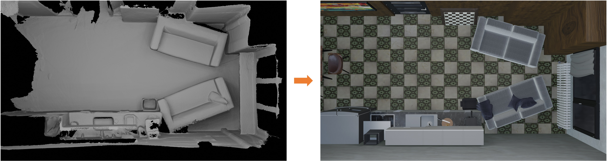
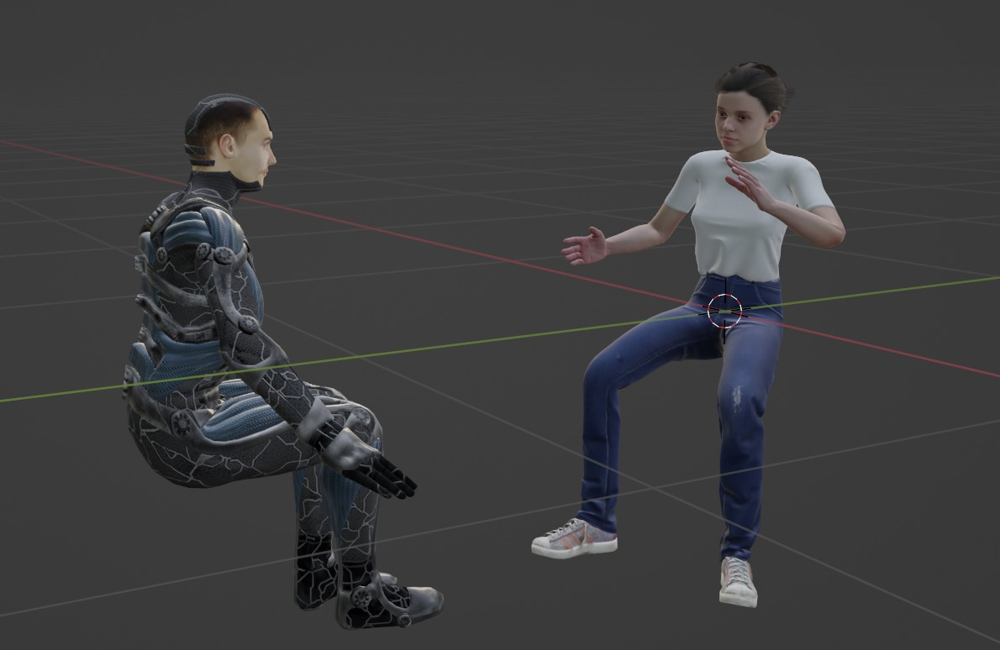
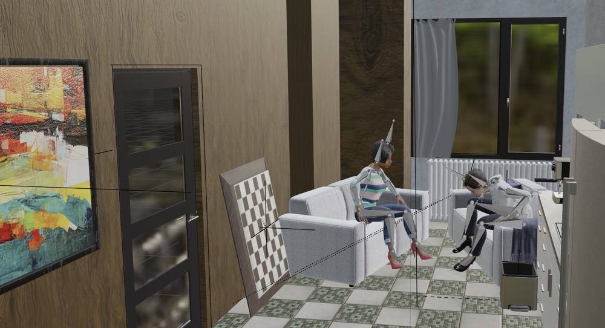
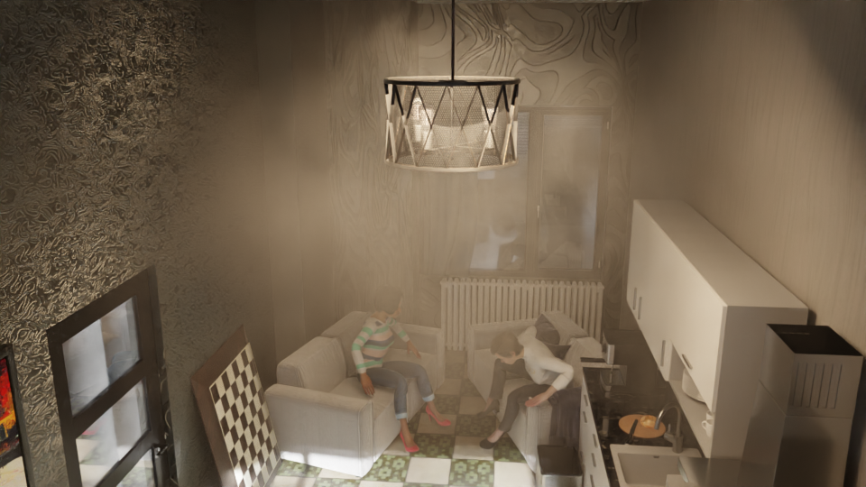

# PixelOdyssey: A Large-Scale Synthetic Dataset for Long-Term Pixel Tracking


This code implements the data generation pipeline of our PixelOdyssey dataset (pre-released version).
## Introduction
The codebase is built upon Blender 3.1+ and tested on Blender 3.30 on Linux and 3.2.2 on MacOS. To setup the environment, first install Blender 3.1+ and then install the required python packages in your conda environment:
```angular2html
conda create -n pixel python=3.9
conda activate pixel
pip install -r requirements.txt
```
And install OpenEXR by running:
```
conda install -c conda-forge openexr-python
```

The data generation pipeline also depends on some addons of Blender, including: 
* [Rokoko Studio Live Plugin for Blender](https://www.rokoko.com/en/products/studio-live-link) (for motion retargeting)
* [SMPL-X Blender Add-on](https://smpl-x.is.tue.mpg.de/) (for human body model)

Please install the addons following the instructions on their websites. If you are using Linux, make sure the addons are available in ```~/.config/blender/$VERSION/scripts/addons```.

## Quick Start
To generate a demo data, simply run:
```angular2html
bash scripts/render_robot.sh
```
You will find the rendered images in ```results/robot/```, including RGB images, depth maps, segmentation maps, and normal maps, as shown below:

If your machine has GPU, set ```--use_gpu``` in the scripts to accelerate rendering.
## Generating Outdoor Data
This codebase supports generating outdoor scenes with deformable objects interacting with the environment. 
To generate outdoor data, you will need:
* HDR environment maps (e.g. from [HDRI Haven](https://hdrihaven.com/))
* Human motion data (e.g. from [AMASS](https://amass.is.tue.mpg.de/))
* Camera data (from [Mannequin Challenge](https://google.github.io/mannequinchallenge/www/index.html))
* 3D models (from [PartNet](https://cs.stanford.edu/~kaichun/partnet/) and [GSO](https://research.google/resources/datasets/scanned-objects-google-research/))
* Humanoid models (e.g., from [BlenderKit](https://www.blenderkit.com/) and [Mixamo](https://www.mixamo.com/))

```./data``` folder shows the directory structure of the required assets. To generate your customized data, you will need to download AMASS data and put it into ```./data/motions``` (e.g., ```./data/motions/CMU/01/01_01_stageii.npz```). 
To enlarge the data diversity, you might also want to download the full dataset of GSO and PartNet.

After preparing the assets, you can run the following command to render outdoor scenes:
```angular2html
bash scripts/render_outdoor.sh
```

You will find the rendered images in ```./results/outdoor/```, similar as shown below:


You can also utilize other deformable models such as animals for data generation. Here is an example of rendering a rabbit from [DeformingThings4D](https://github.com/rabbityl/DeformingThings4D):
```angular2html
bash scripts/render_animal.sh
```
Download the full [DeformingThings4D](https://github.com/rabbityl/DeformingThings4D) and put it into ```./data/deformingthings4d``` to render more data.

## Generating Indoor Data
This part shows how to generate indoor scenes, featuring humanoids with environment-aware interactions. Some Blender skills are required to generate your own data.

We utilize mocap data in real 3D environments and rebuild the scenes in Blender, to support more realistic interactions between humanoids and the scenes. 
Specially, we use:
* Human motions and 3D scene scans from [Egobody](https://sanweiliti.github.io/egobody/egobody.html) and [GIMO](https://github.com/y-zheng18/GIMO)
* 3D furniture models from [BlenderKit](https://www.blenderkit.com/) and [3D-front](https://tianchi.aliyun.com/specials/promotion/alibaba-3d-scene-dataset)
* Virtual humans from [Mixamo](https://www.mixamo.com/) and [Turbosquid](https://www.turbosquid.com/)

We firstly rebuild 3D scenes using the 3D furnitures to replicate specific 3D environments from the real scans. 
Since the human motions from Egobody and GIMO are initially aligned with the scene scans, we can directly import the motions into Blender and render the data. 
In the following, we show how to make your own data based on EgoBody dataset and characters from Mixamo.

### Rebuilding 3D Scenes
To rebuild 3D scenes, you can use [BlenderKit](https://www.blenderkit.com/) to import 3D furnitures in Blender to match the layout of 3D scans:

### Importing Human Motions
Download the [Egobody](https://sanweiliti.github.io/egobody/egobody.html) dataset and put it into ```./data/egobody```. 
Then run the following command to convert the motion data into Blender readable SMPL-X motions.
```angular2html
python -m utils.egobody2amass
```
Download human characters from [Mixamo](https://www.mixamo.com/). Open the fbx file in Blender, rename the ```Armature``` as ```exo_gray``` (anything you want) and save the Blender file as ```exo_gray.blend``` in ```./data/characters```. 
Then run the following command to retarget the motions.
```angular2html
blender --background --python ./utils/egobody_retargeting.py -- --seq recording_20210918_S05_S06_01
```
You will get retargeted motions in ```./data/egobody/scenes/scene.blend```:




Open the rebuilt 3D scene in Blender, and append the retargeted character file.
You can then manually add camera trajectories to render images. You should get something similar to this:



You can also generate multi-view data easily. For example, by attaching the camera to the head bone of the characters, you can render ego-centric views. You can design different camera trajectories to render the scene from diverse views. 

Once you've prepared the scene, run the following command to render it:
```angular2html
bash scripts/render_indoor.sh
```

We also support adding random fogs and randomizing textures to maximize the diversity, by setting ```--add_fog``` and ```--randomize``` in the script:



