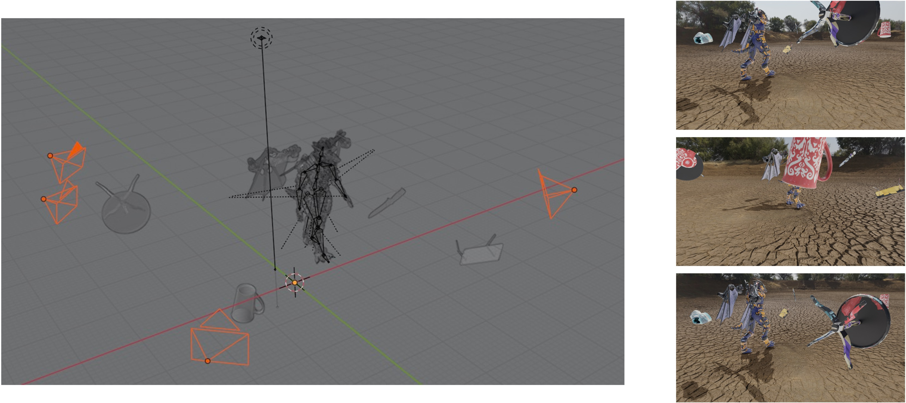
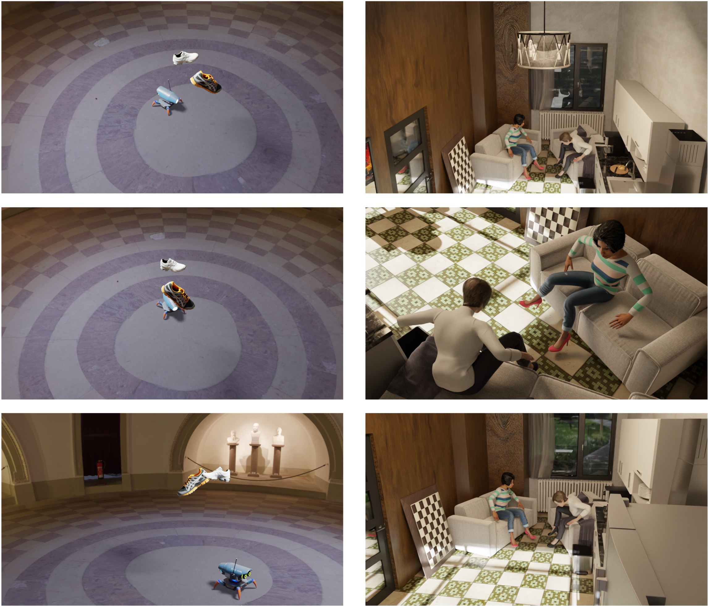

# PointOdyssey: A Large-Scale Synthetic Dataset for Long-Term Point Tracking


This code implements the data generation pipeline of our PointOdyssey dataset.

**[[Paper](https://arxiv.org/abs/2307.15055)] [[Project Page](https://pointodyssey.com/)]**

## Introduction
The codebase is built on Blender 3.1+, and tested on Blender 3.30 on Linux and 3.2.2 on MacOS. To set up the environment, first install Blender 3.1+ and then install the required python packages in your conda environment:
```angular2html
conda create -n point python=3.9
conda activate point
pip install -r requirements.txt
```
And install OpenEXR by running:
```
conda install -c conda-forge openexr-python
```

The data generation pipeline also depends on some addons of Blender, including: 
* [Rokoko Studio Live Plugin for Blender](https://www.rokoko.com/en/products/studio-live-link) (for motion retargeting)
* [SMPL-X Blender Add-on](https://smpl-x.is.tue.mpg.de/) (for human body model)

Please install the addons following the instructions on their websites. If you are using Linux, make sure the addons are available in ```~/.config/blender/$VERSION/scripts/addons```.

## Quick Start
For a quick start, download the demo data [here](https://drive.google.com/file/d/1ZKHjX5A1eiwrvPKZsoagficX8huFvMlE/view?usp=sharing) and run:
```angular2html
bash scripts/render_robot.sh
```
You will find the rendered images in ```results/robot/```, including RGB images, depth maps, segmentation maps, normal maps, and point trajectories:


If a GPU is available on your machine, set ```--use_gpu``` in the scripts to accelerate rendering.

## Generating Outdoor Data
The codebase supports generating outdoor scenes with deformable objects interacting with the environment. 
To generate outdoor data, you will need:
* HDR environment maps (e.g. from [HDRI Haven](https://hdrihaven.com/))
* Human motion data (e.g. from [AMASS](https://amass.is.tue.mpg.de/))
* Camera data (from [Mannequin Challenge](https://google.github.io/mannequinchallenge/www/index.html))
* 3D models (from [PartNet](https://cs.stanford.edu/~kaichun/partnet/) and [GSO](https://research.google/resources/datasets/scanned-objects-google-research/))
* Humanoid models (e.g., from [BlenderKit](https://www.blenderkit.com/) and [Mixamo](https://www.mixamo.com/))

The ```./data``` folder shows the directory structure of the required assets. To generate your customized data, you will need to download AMASS data and put it into ```./data/motions``` (e.g., ```./data/motions/CMU/01/01_01_stageii.npz```). 
To enlarge the data diversity, you might also want to download the full dataset of GSO and PartNet.

After preparing the assets, you can run the following command to render outdoor scenes:
```angular2html
bash scripts/render_outdoor.sh
```

You will find the rendered images in ```./results/outdoor/```, which should look similar to the video below:


In our dataset, we also apply random forces to the objects in the scene to generate more diverse interactions. You can generate such data by adding ```--add_force --scene_root ./data/blender_assets/hdri.blend``` in the script.

You can also utilize other deformable models such as animals for data generation. Here is an example of rendering a rabbit from [DeformingThings4D](https://github.com/rabbityl/DeformingThings4D):
```angular2html
bash scripts/render_animal.sh
```
Download the full [DeformingThings4D](https://github.com/rabbityl/DeformingThings4D) and put it into ```./data/deformingthings4d``` to render more data.

## Generating Indoor Data

In addition to outdoor scenes, we generate realistic indoor scenes, featuring humanoids with environment-aware interactions. To generate new scenes, you will need some skill with Blender. 

We utilize mocap data from real 3D environments and rebuild the associated scenes in Blender, to support realistic interactions between humanoids and the scenes. Specifically, we use:
* Human motions and 3D scene scans from [Egobody](https://sanweiliti.github.io/egobody/egobody.html) and [GIMO](https://github.com/y-zheng18/GIMO)
* 3D furniture models from [BlenderKit](https://www.blenderkit.com/) and [3D-front](https://tianchi.aliyun.com/specials/promotion/alibaba-3d-scene-dataset)
* Virtual humans from [Mixamo](https://www.mixamo.com/) and [Turbosquid](https://www.turbosquid.com/)

In our case, the first step is to rebuild 3D scenes using the downloaded 3D furniture, to replicate specific 3D environments from the real scans.
Since the human motions from Egobody and GIMO are initially aligned with the scene scans, we can directly import the motions into Blender and render the data. 
In the next section, we show how to make your own data based on EgoBody dataset and characters from Mixamo.

### Rebuilding 3D Scenes
To rebuild 3D scenes, you can use [BlenderKit](https://www.blenderkit.com/) to import 3D furniture in Blender to match the layout of 3D scans:


### Importing Human Motions

Download the [Egobody](https://sanweiliti.github.io/egobody/egobody.html) dataset and put it into ```./data/egobody```. 
Then, run the following command to convert the motion data into Blender readable SMPL-X motions.
```angular2html
python -m utils.egobody2amass
```
Download human characters from [Mixamo](https://www.mixamo.com/). Open the fbx file in Blender, rename the ```Armature``` as ```exo_gray``` (or another name you choose) and save the Blender file as ```exo_gray.blend``` in ```./data/characters```. 
Then, run the following command to retarget the motions.
```angular2html
blender --background --python ./utils/egobody_retargeting.py -- --seq recording_20210918_S05_S06_01
```
This will produce retargeted motions in ```./data/egobody/scenes/scene.blend```:


Open the rebuilt 3D scene in Blender, and append the retargeted character file.
You can then manually add camera trajectories to render images. At this point, you should be able to see something similar to the image below:


From this stage, it is easy to generate multi-view data. For example, by attaching the camera to the head bone of the characters, you can render ego-centric views. You can design different camera trajectories to render the scene from diverse views. We provide additional information on multi-view rendering in the next section. 

Once you have prepared the scene, run the following command to render it:
```angular2html
bash scripts/render_indoor.sh
```

We also support adding random fog, and randomizing textures to maximize the diversity, by setting ```--add_fog``` and ```--randomize``` in the script:


## Multi-view Data Generation

The codebase supports generating multi-view data. For a quick start, run:
```angular2html
bash scripts/render_outdoor_multiview.sh
```



In the example above, we render 3 views of an outdoor scene. You can also render more views by setting ```--views``` to a larger number. 
We randomly sample camera trajectories from Mannequin Challenge dataset. You can also manually design camera trajectories to render more diverse views, or use other hand-crafted camera trajectories, by modifying the code in ```render_human.py```.

For indoor scenes, the following script will generate multi-view data with static cameras:
```angular2html
bash scripts/render_indoor_multiview.sh
```

The rendered data should look like this:



## Download

The full dataset can be downloaded from the [project page](https://pointodyssey.com/), under [CC BY-NC-SA 4.0 license](https://creativecommons.org/licenses/by-nc-sa/4.0/). The dataset includes:
* Multi-modal data (RGB, depth, normals, instance segmentation)
* Ground truth 2D trajectories, with visibility lables
* Ground truth 3D trajectories
* Camera parameters

Please refer to [utils/reprojection.py](./utils/reprojection.py) for details on camera conventions, coordinate systems and depth scales.
## Citation

If you use this code or our data for your research, please cite:

**PointOdyssey: A Large-Scale Synthetic Dataset for Long-Term Point Tracking.** Yang Zheng, Adam W. Harley, Bokui Shen, Gordon Wetzstein, Leonidas J. Guibas. In ICCV 2023.

Bibtex:
```
@inproceedings{zheng2023point,
 author = {Yang Zheng and Adam W. Harley and Bokui Shen and Gordon Wetzstein and Leonidas J. Guibas},
 title = {PointOdyssey: A Large-Scale Synthetic Dataset for Long-Term Point Tracking},
 booktitle = {ICCV},
 year = {2023}
}
```
